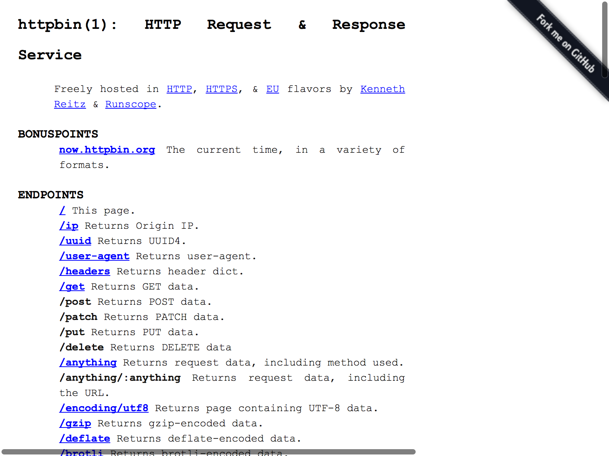

`decapitated` : Headless 'Chrome' Orchestration

The 'Chrome' browser <https://www.google.com/chrome/> has a headless mode
which can be instrumented programmatically. Tools are provided to perform headless
'Chrome' instrumentation on the command-line and will eventually provide support
for the 'DevTools' instrumentation 'API' or the forthcoming 'phantomjs'-like higher-level
'API' being promised by the development team.

### IMPORTANT

This pkg will eventually do much under the covers to find the location of the Chrome binary
on all operating systems. For now, you'll need to set an envrionment variable `HEADLESS_CHROME` to one of these two values:

- Windows: `C:\Program Files\Google\Chrome\Application\chrome.exe`
- macOS: `/Applications/Google\ Chrome.app/Contents/MacOS/Google\ Chrome`

Linux folks will know where their binary is (many of you use non-default locations for things).

Use `~/.Renviron` to store this value for the time being.

The following functions are implemented:

- `chrome_dump_pdf`:	"Print" to PDF
- `chrome_read_html`:	Read a URL via headless Chrome and return the renderd '<body>' 'innerHTML' DOM elements
- `chrome_shot`:	Capture a screenshot
- `chrome_version`:	Get Chrome version

### Installation

```{r eval=FALSE}
devtools::install_github("hrbrmstr/decapitated")
```

```{r message=FALSE, warning=FALSE, error=FALSE, include=FALSE}
options(width=120)
```

### Usage

```{r message=FALSE, warning=FALSE, error=FALSE}
library(decapitated)

# current verison
packageVersion("decapitated")

chrome_version()

chrome_read_html("http://httpbin.org/")
```

```{r eval=FALSE, message=FALSE, warning=FALSE, error=FALSE}
chrome_dump_pdf("http://httpbin.org/")
## [0502/094321.911089:INFO:headless_shell.cc(436)] Written to file output.pdf.
```

```{r message=FALSE, warning=FALSE, error=FALSE, eval=FALSE}
chrome_shot("http://httpbin.org/")

## [0502/094257.370837:INFO:headless_shell.cc(436)] Written to file screenshot.png.
##   format width height colorspace filesize
## 1    PNG  1600   1200       sRGB   238967
```



### Test Results

```{r message=FALSE, warning=FALSE, error=FALSE}
library(decapitated)
library(testthat)

date()

test_dir("tests/")
```

